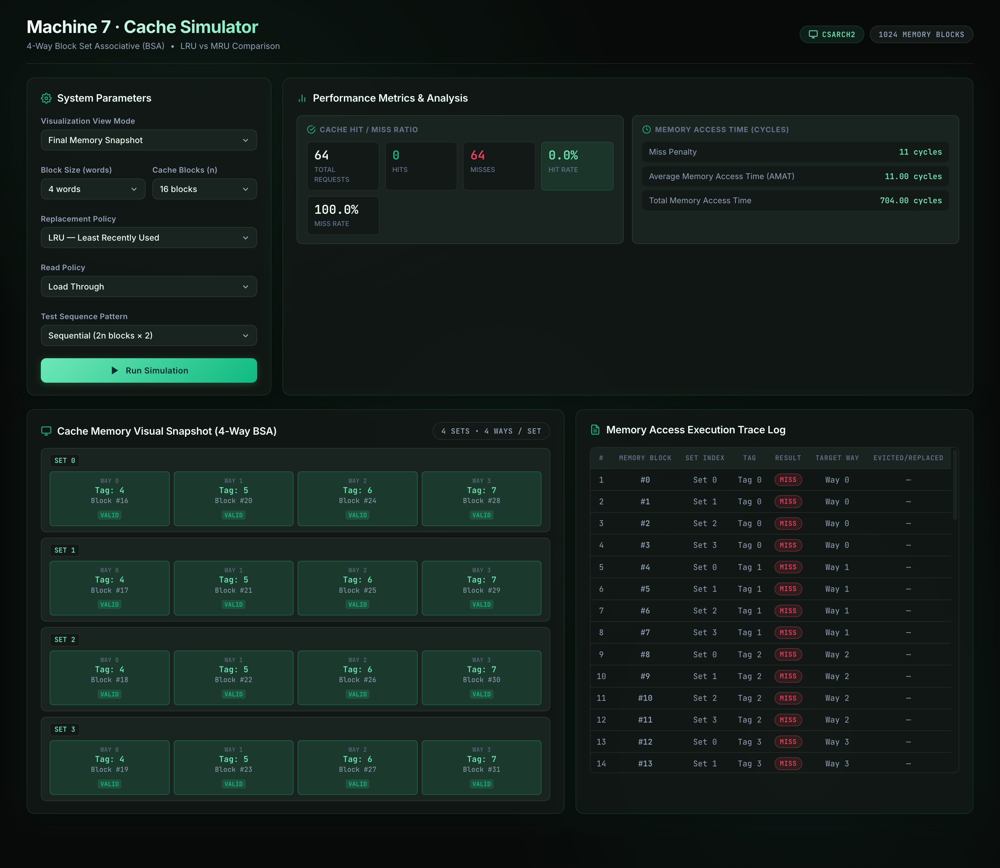
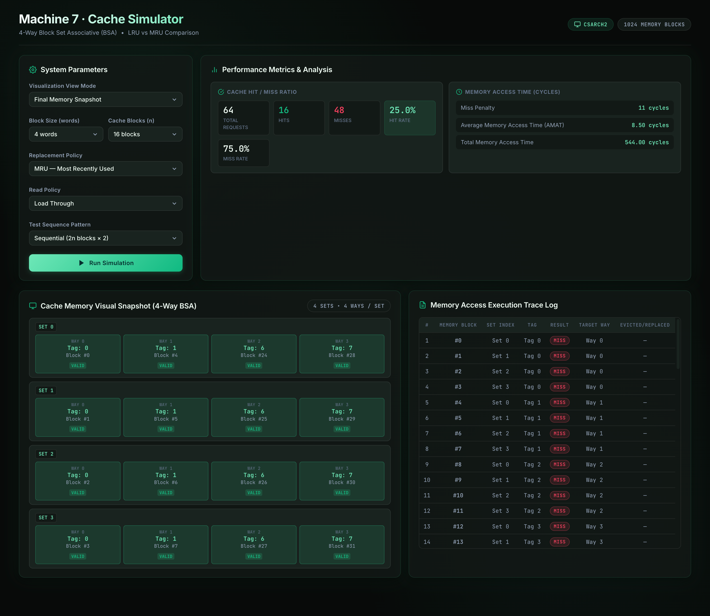

# CSARCH2 Case Study 1: Machine 7 Cache Memory Simulator

## Deployed Link: https://limj72.github.io/CSARCH2-CaseStudy1-Group2/
## Youtube Link: 

> **Machine 7 Configuration:** 4-Way Block Set Associative (BSA) — **LRU vs. MRU Replacement Policies**

An interactive, web-based **Cache Memory Simulator** designed for CSARCH2 (Computer Architecture 2). This application simulates a **4-Way Block Set Associative (BSA)** cache memory system comparing **Least Recently Used (LRU)** and **Most Recently Used (MRU)** replacement policies, featuring real-time state visualization, step-by-step trace execution, and detailed timing statistics.

---

## Table of Contents
1. [Quick Start Guide](#-quick-start-guide)
2. [Machine 7 Full Specifications & Parameters](#-machine-7-full-specifications--parameters)
3. [Mathematical Timing & Metric Models](#-mathematical-timing--metric-models)
4. [Detailed Analysis Write-up (LRU vs. MRU)](#-detailed-analysis-write-up-lru-vs-mru)
   - [Test Case A: Sequential Sequence](#test-case-a-sequential-sequence)
   - [Test Case B: Mid-Repeat Sequence](#test-case-b-mid-repeat-sequence)
   - [Test Case C: Random Sequence](#test-case-c-random-sequence)
   - [Comparative Summary & Architectural Insights](#comparative-summary--architectural-insights)
5. [System Features & User Guide](#-system-features--user-guide)
6. [Repository Structure](#-repository-structure)

---

## Quick Start Guide

### Prerequisites
- **Node.js** (v18.0.0 or higher recommended)
- **npm** (v9.0.0 or higher)

### Setup & Running Instructions

1. **Navigate into the application directory**:
   ```bash
   cd cache-simulator
   ```

2. **Install project dependencies**:
   ```bash
   npm install
   ```

3. **Start the local Vite development server**:
   ```bash
   npm run dev
   ```

4. **Access the application**:
   Open your web browser and navigate to `http://localhost:5173`.

### Build & Utility Commands

Inside `cache-simulator/`:
- `npm run dev`: Launches local development server with HMR.
- `npm run build`: Compiles TypeScript and builds production assets into `dist/`.
- `npm run preview`: Previews the production build locally.
- `npm run lint`: Runs Oxlint code inspection.

---

## Machine 7 Full Specifications & Parameters

| Parameter | Specification / Value | Description |
| :--- | :--- | :--- |
| **Machine ID** | **Machine 7** | 4-Way Block Set Associative (BSA) |
| **Associativity** | **4-Way Set Associative** | Fixed at 4 blocks per set ($K = 4$). |
| **Main Memory Size** | **1024 Blocks** | Memory block addresses range from `0` to `1023`. |
| **Number of Cache Blocks ($n$)** | **Parameterized** | Power of 2, minimum 4 blocks (16 blocks recommended). |
| **Number of Cache Sets ($S$)** | **$S = n / 4$** | Derived automatically from total cache blocks. |
| **Block Size ($B$)** | **Parameterized** | Power of 2 (2, 4, 8, 16 words per block; minimum 2 words). |
| **Read Policy** | **Parameterized** | **Non-Load-Through** vs. **Load-Through**. |
| **Replacement Policies** | **LRU vs. MRU** | Least Recently Used vs. Most Recently Used. |
| **Cache Hit Time ($T_{\text{hit}}$)** | **1 cycle** | Time unit required to read from cache memory. |
| **Memory Word Access Time ($T_{\text{mem}}$)** | **10 cycles** | Time unit required to access a single word in main memory. |

### Address Mapping Logic (Set Associative)
For a given main memory block index $M$:
- **Set Index ($S_{\text{idx}}$)** = $M \pmod S$
- **Tag ($T$)** = $\lfloor M / S \rfloor$

---

## Mathematical Timing & Metric Models

### Required Statistical Outputs

The simulation engine measures and computes all 7 required metrics:

1. **Total Access Count** ($N$): Total memory access requests issued.
2. **Cache Hit Count** ($H$): Number of access requests satisfied by cache.
3. **Cache Miss Count** ($M$): Number of access requests that resulted in cache misses.
4. **Cache Hit Rate**: $\text{Hit Rate}=\frac{H}{N}$
5. **Cache Miss Rate**: $\text{Miss Rate}=\frac{M}{N}=1-\text{Hit Rate}$
6. **Average Memory Access Time (AMAT)**: $\text{AMAT}=(T_{\text{hit}}\times\text{Hit Rate})+(\text{Miss Penalty}\times\text{Miss Rate})$
7. **Total Memory Access Time**: $\text{Total Access Time}=\text{AMAT}\times N$

---

### Read Policy Miss Penalty Formulas

* **Non-Load-Through Policy**:
  When a cache miss occurs, the CPU must wait while the entire main memory block ($B$ words) is transferred into the cache before reading the target word from cache.
  
  $$
  \text{Miss Penalty}_{\text{Non-Load}} = T_{\text{hit}} + (B \times T_{\text{mem}}) + T_{\text{hit}}
  $$

> For $B = 4$ words, $T_{\text{hit}} = 1$, and $T_{\text{mem}} = 10$: $\text{Miss Penalty} = 1 + (4 \times 10) + 1 = 42\text{ cycles}$.

* **Load-Through Policy**:
  When a cache miss occurs, the requested word is forwarded directly from main memory to the CPU while the block is loaded into cache in parallel.
  
  $$
  \text{Miss Penalty}_{\text{Load}} = T_{\text{hit}} + T_{\text{mem}}
  $$

> For $T_{\text{hit}} = 1$ and $T_{\text{mem}} = 10$: $\text{Miss Penalty} = 1 + 10 = 11\text{ cycles}$.
---

## Detailed Analysis Write-up (LRU vs. MRU)

The following benchmark analysis compares **4-Way BSA + LRU** against **4-Way BSA + MRU** across the three standard test sequences with $n = 16$ cache blocks (4 sets of 4 ways each) and block size $B = 4$ words.

---
### Test Case A: Sequential Sequence

- **Pattern Definition**: Access up to $2n = 32$ cache blocks ($0, 1, 2, \dots, 31$) and repeat the sequence twice.
- **Total Accesses**: 64 memory block accesses.
- **Working Set**: 32 distinct memory blocks mapped across 4 cache sets, with 8 different blocks competing for the 4 ways in each set.
- **Configuration Used**:
  - Block Size: 4 words
  - Cache Blocks: 16 blocks
  - Number of Sets: 4
  - Main Memory Size: 1024 blocks

#### Benchmark Results

| Replacement Policy | Read Policy | Total Accesses | Hits | Misses | Hit Rate | Miss Rate | AMAT (cycles) | Total Access Time (cycles) |
| :--- | :--- | :---: | :---: | :---: | :---: | :---: | :---: | :---: |
| **LRU** | Load-Through | 64 | 0 | 64 | **0.00%** | **100.00%** | 11.00 | 704.00 |
| **MRU** | Load-Through | 64 | 16 | 48 | **25.00%** | **75.00%** | 8.50 | 544.00 |
| **LRU** | Non-Load-Through | 64 | 0 | 64 | **0.00%** | **100.00%** | 42.00 | 2,688.00 |
| **MRU** | Non-Load-Through | 64 | 16 | 48 | **25.00%** | **75.00%** | 31.75 | 2,032.00 |

#### LRU Simulation Output


#### MRU Simulation Output


#### Analysis

The sequential access sequence uses a working set of $2n = 32$ blocks, which is twice the cache capacity of $n = 16$ blocks.

- **LRU Behavior — 0.00% Hit Rate**: LRU removes the block that has not been accessed for the longest time. During the first pass from block $0$ to block $31$, the earlier blocks are gradually removed from the cache. When the sequence returns to block $0$ during the second pass, it is no longer available in the cache. The same behavior continues for every block, causing complete cache thrashing and producing 64 misses.

- **MRU Behavior — 25.00% Hit Rate**: MRU removes the most recently accessed block whenever a set is full. For example, blocks $0$, $4$, $8$, and $12$ initially fill Set 0. When another block mapped to Set 0 is accessed, MRU removes the most recently inserted block while preserving older blocks. As a result, several early blocks remain in the cache and produce 16 hits during the second pass.

- **Read Policy Comparison**: Load-Through and Non-Load-Through produce the same number of hits and misses because the read policy does not affect cache replacement. However, Non-Load-Through has a higher miss penalty because the entire block must be transferred before the requested word can be accessed.


---

### Test Case B: Mid-Repeat Sequence

- **Pattern Definition**:
  1. Access blocks $0$ to $n-1$ or $0$ to $15$.
  2. Access blocks $0$ to $2n-1$ or $0$ to $31$ twice.
  3. Access blocks $n-1$ to $0$ or $15$ to $0$ in reverse.
  4. Access blocks $2n-1$ to $0$ or $31$ to $0$ twice.
- **Total Accesses**: 160 memory block accesses.
- **Working Set**: The pattern alternates between a 16-block working set and a larger 32-block working set while also changing the direction of access.
- **Configuration Used**:
  - Block Size: 4 words
  - Cache Blocks: 16 blocks
  - Number of Sets: 4
  - Main Memory Size: 1024 blocks

#### Benchmark Results

| Replacement Policy | Read Policy | Total Accesses | Hits | Misses | Hit Rate | Miss Rate | AMAT (cycles) | Total Access Time (cycles) |
| :--- | :--- | :---: | :---: | :---: | :---: | :---: | :---: | :---: |
| **LRU** | Load-Through | 160 | 16 | 144 | **10.00%** | **90.00%** | 10.00 | 1,600.00 |
| **MRU** | Load-Through | 160 | 68 | 92 | **42.50%** | **57.50%** | 6.75 | 1,080.00 |
| **LRU** | Non-Load-Through | 160 | 16 | 144 | **10.00%** | **90.00%** | 37.90 | 6,064.00 |
| **MRU** | Non-Load-Through | 160 | 68 | 92 | **42.50%** | **57.50%** | 24.57 | 3,932.00 |

#### LRU Simulation Output


#### MRU Simulation Output


#### Analysis

The Mid-Repeat sequence contains forward repetitions, reverse repetitions, and changes in the size of the active working set.

- **LRU Behavior — 10.00% Hit Rate**: LRU performs poorly during the repeated $0$ to $31$ sequences because the 32-block working set exceeds the 16-block cache capacity. Most earlier blocks are removed before they are accessed again. Some hits occur when the sequence changes direction because recently accessed blocks may still be available in the cache.

- **MRU Behavior — 42.50% Hit Rate**: MRU performs better because it repeatedly removes the newest block in a full set while allowing older blocks to remain. These retained blocks are accessed again during the repeated and reversed portions of the sequence, resulting in 68 cache hits.

- **Policy Comparison**: MRU achieves 52 more hits than LRU and reduces the total Load-Through access time from 1,600 cycles to 1,080 cycles. This shows that MRU is more suitable for this specific repeated and reversing access pattern.

- **Read Policy Comparison**: The hit and miss counts remain unchanged between the two read policies. The difference appears only in AMAT and total access time because Non-Load-Through has a substantially higher miss penalty.

---

### Test Case C: Random Sequence
- **Pattern Definition**: 64 random memory block accesses within the address space $0 \dots 1023$.

#### Benchmark Results:
| Policy | Read Policy | Total Accesses | Hits | Misses | Hit Rate | Miss Rate | AMAT (cycles) | Total Access Time (cycles) |
| :--- | :--- | :---: | :---: | :---: | :---: | :---: | :---: | :---: |
| **LRU** | Load-Through | 64 | 0 | 64 | **0.00%** | **100.00%** | 11.00 | 704.00 |
| **MRU** | Load-Through | 64 | 1 | 63 | **1.56%** | **98.44%** | 10.84 | 694.00 |
| **LRU** | Non-Load-Through | 64 | 0 | 64 | **0.00%** | **100.00%** | 42.00 | 2,688.00 |
| **MRU** | Non-Load-Through | 64 | 1 | 63 | **1.56%** | **98.44%** | 41.36 | 2,647.00 |

#### Analysis:
With 1024 possible main memory blocks and only 16 cache blocks, uniformly random accesses exhibit very low temporal locality. Both policies experience high miss rates ($\approx 98\% - 100\%$). However, MRU occasionally catches accidental re-references to older blocks retained in lower way indices.

---

### Comparative Summary & Architectural Insights

1. **Cyclic Working Sets & Belady's Anomaly**:
   When the active working set exceeds cache capacity ($2n > n$), **LRU exhibits worst-case performance (0% hit rate)** due to cyclic thrashing. **MRU preserves an upper bound hit rate of $\approx 25\% - 42.5\%$** by protecting early set ways from eviction.

2. **Impact of Read Policy on Performance**:
   - **Load-Through** drastically reduces miss penalty ($11\text{ cycles}$ vs $42\text{ cycles}$ for $B=4$), resulting in up to **$3.8\times$ lower Total Memory Access Time**.
   - As Block Size $B$ increases under **Non-Load-Through**, miss penalty grows linearly ($B \times T_{\text{mem}} + 1$), underscoring the efficiency of Load-Through in modern memory controllers.

---

## System Features & User Guide

- **Visual Cache Inspector**: View live grid states of all cache sets, ways, tags, valid bits, and block contents.
- **Trace Execution Modes**: Toggle between **Final Snapshot** or step-by-step **Animated Trace** with step navigation controls (Previous / Next).
- **Execution Log Table**: Comprehensive log table detailing each memory access request, set index, tag, hit/miss outcome, allocated way, and replacement flag.
- **Dynamic Parameterization**: Adjust Block Size, Cache Blocks, Read Policy, and Replacement Policy on the fly.

---

## Repository Structure

```
CSARCH2-CaseStudy1-Group2/
├── README.md                 # Primary documentation, specs & Machine 7 analysis
└── cache-simulator/          # React + Vite TypeScript web application
    ├── public/               # Static assets
    ├── src/
    │   ├── components/       # UI Components (CacheGrid, ControlPanel, TraceLog, Stats)
    │   ├── pages/            # Simulator Page layout
    │   ├── simulator/        # Core Cache Engine & Policies (LRU, MRU, Statistics, Generator)
    │   ├── types/            # TypeScript type definitions
    │   ├── App.tsx           # Main Application component
    │   └── main.tsx          # Application entry point
    ├── package.json          # Project configuration & scripts
    └── vite.config.ts        # Vite configuration
```
